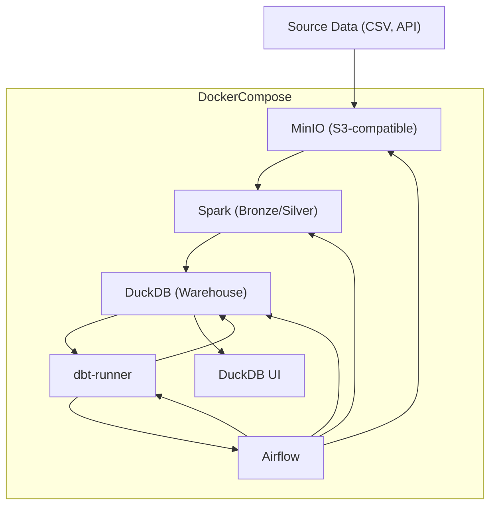
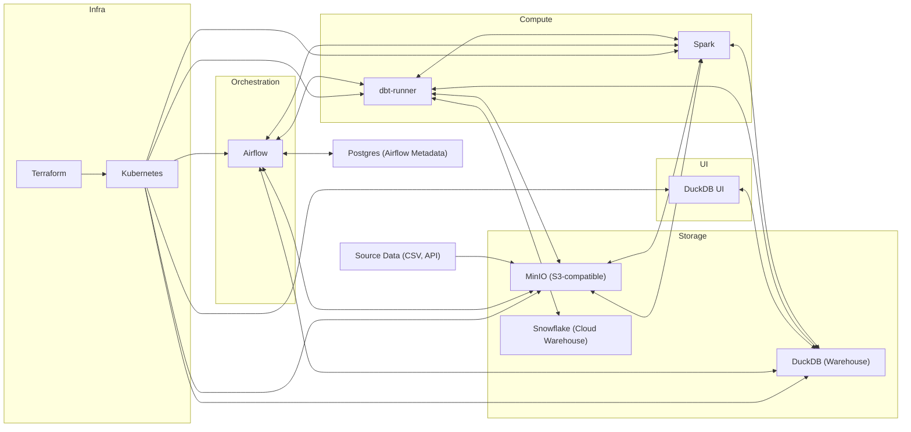
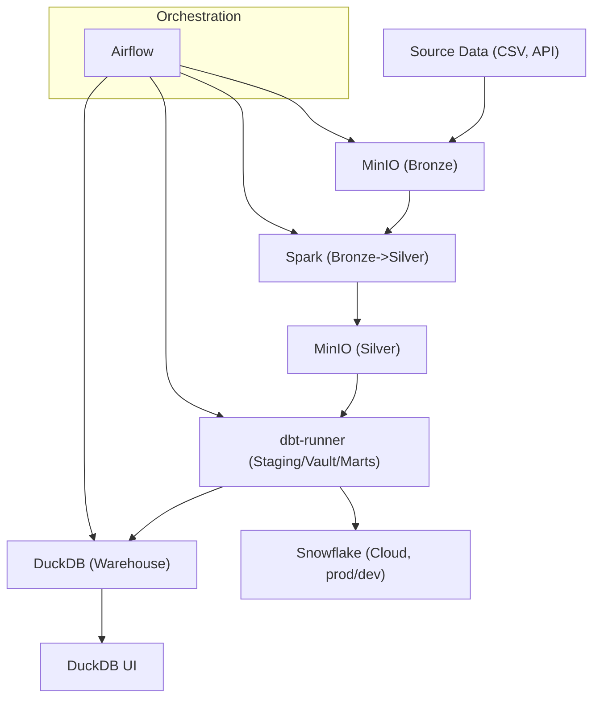

# Project Architecture

This document provides a high-level overview of the Snowflake-DBT-On-AWS platform architecture, including core components, data flow, and deployment topology.

## Architecture Diagram

## Component Diagram

This diagram shows the main platform components and their relationships.

## Data Flow Diagram

This diagram illustrates the step-by-step movement of data through the platform.

## Core Components

- **MinIO**: S3-compatible object storage for raw and processed data (Bronze/Silver/Gold layers).
- **Spark**: Handles large-scale data ingestion and transformation (Bronze/Silver processing).
- **DuckDB**: Local analytical database for warehouse storage (used in local/dev mode).
- **dbt-runner**: Executes dbt models, writing results to DuckDB.
- **DuckDB UI**: Web-based UI for querying and inspecting the DuckDB warehouse.
- **Airflow**: Orchestrates all ETL/ELT workflows and dependencies.
- **Postgres**: Metadata database for Airflow.
- **Terraform/K8S**: Infrastructure as code and cloud deployment (for prod/Snowflake targets).

## Data Flow

1. **Ingestion**: Source data (CSV, API) is loaded into MinIO (Bronze layer).
2. **Processing**: Spark jobs transform Bronze data to Silver, writing back to MinIO.
3. **Warehouse**: dbt-runner reads from MinIO/Silver and writes models to DuckDB (local) or Snowflake (cloud).
4. **Orchestration**: Airflow DAGs coordinate all steps, triggering Spark, dbt, and data quality checks.
5. **Exploration**: DuckDB UI provides a web interface for analysts to query the warehouse.

## Deployment Topology

- All core services run as containers in Docker Compose for local development.
- In production, Spark, Airflow, and dbt can be deployed on Kubernetes, with Snowflake as the warehouse.

---

For more details, see:
- [README.md](../README.md)
- [docker/README.md](../docker/README.md)
- [dbt/README.md](../dbt/README.md)
- [dags/README.md](../dags/README.md)
